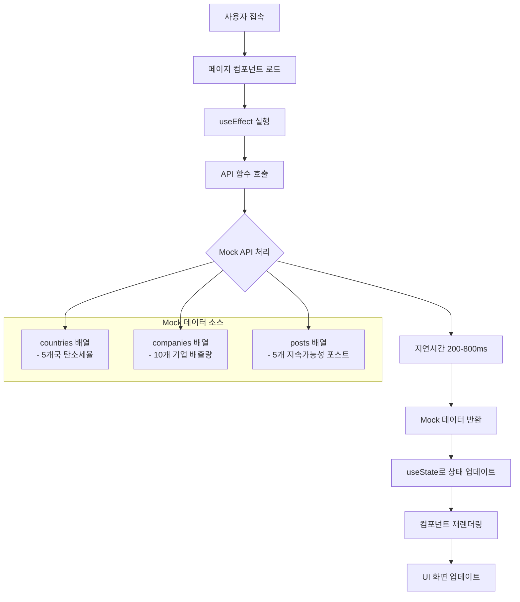

# 아키텍처 개요

## 시스템 아키텍처

HanaLoop 탄소 배출량 대시보드는 Next.js 14의 App Router 패턴을 사용하는 현대적인 React 기반 아키텍처를 따릅니다. 시스템은 최적의 성능, 유지보수성, 사용자 경험을 위해 설계되었습니다.

## 데이터 플로우 아키텍처

### 1. 전체 데이터 플로우



### 2. 구체적인 데이터 플로우 과정

**1단계: 페이지 로딩**

```typescript
// 사용자가 페이지 접속 시
export default function DashboardPage() {
  const [companies, setCompanies] = useState<Company[]>([]);
  const [loading, setLoading] = useState(true);

  // 페이지 마운트 시 자동 실행
  useEffect(() => {
    loadData();
  }, []);
}
```

**2단계: API 호출**

```typescript
async function loadData() {
  setLoading(true); // 로딩 상태 시작

  try {
    // 여러 API를 동시에 호출
    const [companiesData, countriesData] = await Promise.all([
      fetchCompanies(), // 회사 데이터
      fetchCountries(), // 국가 데이터
    ]);

    setCompanies(companiesData); // 상태 업데이트
    setCountries(countriesData);
  } catch (error) {
    setError(error.message); // 에러 처리
  } finally {
    setLoading(false); // 로딩 완료
  }
}
```

**3단계: Mock API 처리**

```typescript
// lib/api.ts에서 실제 동작
export async function fetchCompanies(): Promise<Company[]> {
  await jitter(); // 200-800ms 무작위 지연

  // 실패 시뮬레이션 (15% 확률)
  if (Math.random() < 0.15) {
    throw new Error("네트워크 에러 시뮬레이션");
  }

  return companies; // lib/data.ts의 Mock 데이터 반환
}
```

**4단계: UI 업데이트**

```typescript
// 데이터 로딩 중
if (loading) {
  return <SkeletonLoader />; // 스켈레톤 UI 표시
}

// 데이터 로딩 완료 후
return (
  <div>
    <MetricsCards companies={companies} /> {/* 메트릭 카드 */}
    <EmissionsChart data={emissions} /> {/* 차트 */}
  </div>
);
```

### 3. 데이터 흐름 상세 분석

**페이지별 데이터 플로우**:

1. **메인 대시보드 (`/`)**:

   ```
   fetchCompanies() + fetchCountries()
   → 총 배출량, 탄소세, 나무 수 계산
   → MetricsCards + Charts 렌더링
   ```

2. **회사 관리 (`/companies`)**:

   ```
   fetchCompanies()
   → 회사별 데이터 정리
   → CompanyCards + 개별 차트 렌더링
   ```

3. **탄소세 계산기 (`/calculator`)**:
   ```
   fetchCountries()
   → 국가별 세율 로드
   → 사용자 입력 × 세율 = 실시간 계산
   ```

**데이터 변환 과정**:

```typescript
// 원본 Mock 데이터 → UI에서 사용할 형태로 변환
const totalEmissions = companies.reduce((sum, company) => {
  return (
    sum +
    company.emissions.reduce((companySum, emission) => {
      return companySum + emission.emissions;
    }, 0)
  );
}, 0);

// 계산된 데이터를 차트용으로 변환
const chartData = companies.map((company) => ({
  name: company.name,
  value: calculateTotalEmissions(company),
}));
```

### 4. 컴포넌트 계층 구조

```
app/layout.tsx (루트 레이아웃)
├── DashboardLayout
│   ├── Sidebar Navigation
│   ├── Mobile Navigation
│   └── Main Content Area
│       ├── 페이지 컴포넌트
│       │   ├── Dashboard (/)
│       │   ├── Companies (/companies)
│       │   ├── Emissions (/emissions)
│       │   ├── Calculator (/calculator)
│       │   └── Trees (/trees)
│       └── 공유 컴포넌트
│           ├── MetricsCards
│           ├── Charts (Recharts)
│           ├── UI Components (Radix)
│           └── Animations (Framer Motion)
```

### 5. 상태 관리 플로우

**React의 내장 상태 관리 사용**:

애플리케이션은 Redux나 Zustand 같은 외부 라이브러리 없이 React의 useState와 useEffect만 사용합니다.

```typescript
// 모든 페이지에서 공통으로 사용하는 패턴
function DataPage() {
  // 1. 상태 정의
  const [data, setData] = useState<DataType[]>([]);
  const [loading, setLoading] = useState(true);
  const [error, setError] = useState<string | null>(null);

  // 2. 데이터 로딩 함수
  async function loadData() {
    try {
      setLoading(true); // 로딩 시작
      const result = await fetchData(); // API 호출
      setData(result); // 데이터 저장
    } catch (err) {
      setError(err.message); // 에러 저장
    } finally {
      setLoading(false); // 로딩 종료
    }
  }

  // 3. 컴포넌트 마운트 시 자동 실행
  useEffect(() => {
    loadData();
  }, []); // 빈 의존성 배열 = 한 번만 실행

  // 4. 상태에 따른 UI 렌더링
  if (loading) return <Skeleton />;
  if (error) return <ErrorMessage />;
  return <DataDisplay data={data} />;
}
```

**상태 전파 방식**:

- 부모 → 자식: props를 통한 데이터 전달
- 자식 → 부모: 콜백 함수를 통한 이벤트 전달
- 형제 컴포넌트: 공통 부모에서 상태 관리

## API 레이어 아키텍처

### Mock API 설계

API 레이어는 다음과 같은 특성을 가진 실제 백엔드를 시뮬레이션합니다:

- **지연시간 시뮬레이션**: `jitter()`를 사용한 200-800ms 응답 시간
- **실패 시뮬레이션**: 쓰기 작업에 대해 15% 실패율
- **인메모리 저장소**: 세션 동안 데이터 지속성을 위한 가변 배열
- **타입 안전성**: 모든 API 응답에 대한 완전한 TypeScript 커버리지

```typescript
// API 레이어 구조
lib/api.ts
├── fetchCountries() → Country[]
├── fetchCompanies() → Company[]
├── fetchPosts() → Post[]
└── createOrUpdatePost() → Post (실패 시뮬레이션 포함)

lib/data.ts
├── countries: Country[] (세율이 있는 5개국)
├── companies: Company[] (10개 다국적 기업)
└── posts: Post[] (5개 지속가능성 포스트)
```

## 컴포넌트 아키텍처

### 1. 기능별 컴포넌트

도메인별로 구성된 기능별 컴포넌트:

```
components/
├── dashboard/ (메트릭 및 개요)
├── charts/ (데이터 시각화)
├── navigation/ (사이드바, 모바일 네비게이션)
├── calculator/ (탄소세 계산기)
├── trees/ (환경 영향도)
└── layout/ (페이지 레이아웃)
```

## 성능 아키텍처

### 1. 렌더링 최적화

- **App Router**: 기본적으로 서버사이드 렌더링
- **Turbo 모드**: 빠른 개발 빌드
- **코드 분할**: 자동 라우트 기반 분할
- **이미지 최적화**: Next.js 자동 이미지 최적화

### 2. 번들 아키텍처

```
빌드 출력물:
├── _app.js (핵심 React/Next.js)
├── pages/ (라우트 기반 청크)
├── chunks/ (공유 컴포넌트 청크)
└── static/ (CSS, 폰트, 이미지)
```

## 배포 아키텍처

### 개발환경

- **로컬 개발**: Turbopack을 사용한 `bun run dev`
- **핫 리로드**: 즉시 컴포넌트 업데이트
- **Mock API**: 외부 의존성 없음

### 프로덕션

- **정적 내보내기**: 최적화된 번들을 생성하는 `bun run build`
- **CDN 준비**: CDN 배포에 최적화된 정적 애셋
- **범용 배포**: Vercel

### 향후 확장성

- **데이터베이스 통합**: PostgreSQL/MongoDB 통합 준비
- **API Gateway**: 마이크로서비스 연결 가능
- **상태 관리**: 필요시 Redux/Zustand로 업그레이드 가능
- **캐싱**: Redis 통합 준비
