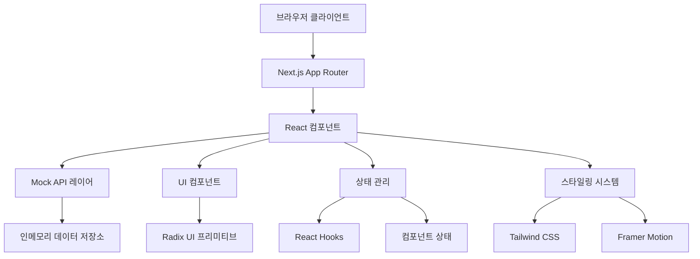

# 아키텍처 개요

## 시스템 아키텍처

HanaLoop 탄소 배출량 대시보드는 Next.js 14의 App Router 패턴을 사용하는 현대적인 React 기반 아키텍처를 따릅니다. 시스템은 최적의 성능, 유지보수성, 사용자 경험을 위해 설계되었습니다.

### 고수준 아키텍처



## 데이터 플로우 아키텍처

### 1. 데이터 소스 및 플로우

```
[Mock 데이터] → [API 레이어] → [React 컴포넌트] → [UI 렌더링]
     ↓              ↓              ↓              ↓
[국가 데이터]    [fetch*()]    [useState/useEffect]  [차트/테이블]
[회사 데이터]    [시뮬레이션]   [컴포넌트 상태]      [애니메이션]
[포스트 데이터]  [지연시간]     [로딩 상태]         [인터랙션]
```

### 2. 컴포넌트 계층 구조

```
app/layout.tsx (루트 레이아웃)
├── DashboardLayout
│   ├── Sidebar Navigation
│   ├── Mobile Navigation
│   └── Main Content Area
│       ├── 페이지 컴포넌트
│       │   ├── Dashboard (/)
│       │   ├── Companies (/companies)
│       │   ├── Emissions (/emissions)
│       │   ├── Calculator (/calculator)
│       │   └── Trees (/trees)
│       └── 공유 컴포넌트
│           ├── MetricsCards
│           ├── Charts (Recharts)
│           ├── UI Components (Radix)
│           └── Animations (Framer Motion)
```

### 3. 상태 관리 플로우

애플리케이션은 외부 라이브러리 없이 React의 내장 상태 관리를 사용합니다:

```typescript
// 앱 전반에서 사용되는 데이터 페칭 패턴
const [data, setData] = useState<DataType[]>([]);
const [loading, setLoading] = useState(true);
const [error, setError] = useState<string | null>(null);

useEffect(() => {
  async function loadData() {
    try {
      setLoading(true);
      const result = await fetchData(); // 지연시간이 있는 Mock API
      setData(result);
    } catch (err) {
      setError(err.message);
    } finally {
      setLoading(false);
    }
  }
  loadData();
}, []);
```

## API 레이어 아키텍처

### Mock API 설계

API 레이어는 다음과 같은 특성을 가진 실제 백엔드를 시뮬레이션합니다:

- **지연시간 시뮬레이션**: `jitter()`를 사용한 200-800ms 응답 시간
- **실패 시뮬레이션**: 쓰기 작업에 대해 15% 실패율
- **인메모리 저장소**: 세션 동안 데이터 지속성을 위한 가변 배열
- **타입 안전성**: 모든 API 응답에 대한 완전한 TypeScript 커버리지

```typescript
// API 레이어 구조
lib/api.ts
├── fetchCountries() → Country[]
├── fetchCompanies() → Company[]
├── fetchPosts() → Post[]
└── createOrUpdatePost() → Post (실패 시뮬레이션 포함)

lib/data.ts
├── countries: Country[] (세율이 있는 5개국)
├── companies: Company[] (10개 다국적 기업)
└── posts: Post[] (5개 지속가능성 포스트)
```

## 컴포넌트 아키텍처

### 1. UI 컴포넌트 시스템

커스텀 스타일링이 적용된 Radix UI 프리미티브 기반:

```
components/ui/
├── 기본 컴포넌트 (Radix UI)
│   ├── Button, Card, Input
│   ├── Select, Progress, Skeleton
│   └── Sheet, Separator, Badge
├── 커스텀 컴포넌트
│   ├── AnimatedCounter (Framer Motion)
│   └── FloatingParticles (애니메이션)
```

### 2. 기능별 컴포넌트

도메인별로 구성된 기능별 컴포넌트:

```
components/
├── dashboard/ (메트릭 및 개요)
├── charts/ (데이터 시각화)
├── navigation/ (사이드바, 모바일 네비게이션)
├── calculator/ (탄소세 계산기)
├── trees/ (환경 영향도)
└── layout/ (페이지 레이아웃)
```

### 3. 차트 아키텍처

데이터 시각화를 위한 Recharts 사용:

```typescript
// 차트 컴포넌트 패턴
const EmissionsChart: React.FC<{data: GhgEmission[]}> = ({ data }) => {
  const chartData = useMemo(() => transformData(data), [data]);

  return (
    <ResponsiveContainer>
      <LineChart data={chartData}>
        <Line dataKey="emissions" stroke="#22c55e" />
        <XAxis dataKey="yearMonth" />
        <YAxis />
        <Tooltip />
      </LineChart>
    </ResponsiveContainer>
  );
};
```

## 성능 아키텍처

### 1. 렌더링 최적화

- **App Router**: 기본적으로 서버사이드 렌더링
- **Turbo 모드**: 빠른 개발 빌드
- **코드 분할**: 자동 라우트 기반 분할
- **이미지 최적화**: Next.js 자동 이미지 최적화

### 2. 번들 아키텍처

```
빌드 출력물:
├── _app.js (핵심 React/Next.js)
├── pages/ (라우트 기반 청크)
├── chunks/ (공유 컴포넌트 청크)
└── static/ (CSS, 폰트, 이미지)
```

### 3. 캐싱 전략

- **정적 생성**: 가능한 경우 빌드 타임 페이지 생성
- **클라이언트 사이드 캐싱**: React 상태를 통한 컴포넌트 레벨 데이터 캐싱
- **브라우저 캐싱**: Next.js를 통한 최적화된 애셋 캐싱

## 보안 아키텍처

### 1. 데이터 검증

- **TypeScript**: 컴파일 타임 타입 체킹
- **Zod 스키마**: 런타임 데이터 검증 (구현 준비 완료)
- **API 검증**: API 레이어의 입력 검증

### 2. 클라이언트 사이드 보안

- **민감 데이터 없음**: 모든 데이터는 모의/시연 데이터
- **CSP 준비**: Content Security Policy 호환
- **HTTPS 전용**: 프로덕션 배포 보안

## 배포 아키텍처

### 개발환경
- **로컬 개발**: Turbopack을 사용한 `npm run dev`
- **핫 리로드**: 즉시 컴포넌트 업데이트
- **Mock API**: 외부 의존성 없음

### 프로덕션
- **정적 내보내기**: 최적화된 번들을 생성하는 `npm run build`
- **CDN 준비**: CDN 배포에 최적화된 정적 애셋
- **범용 배포**: Vercel, Netlify, AWS 등과 호환

## 확장성 고려사항

### 현재 제한사항
- **인메모리 저장소**: 서버 재시작 시 데이터 리셋
- **단일 인스턴스**: 수평 확장 지원 없음
- **Mock API**: 프로덕션 준비되지 않은 데이터 레이어

### 향후 확장성
- **데이터베이스 통합**: PostgreSQL/MongoDB 통합 준비
- **API Gateway**: 마이크로서비스 연결 가능
- **상태 관리**: 필요시 Redux/Zustand로 업그레이드 가능
- **캐싱**: Redis 통합 준비